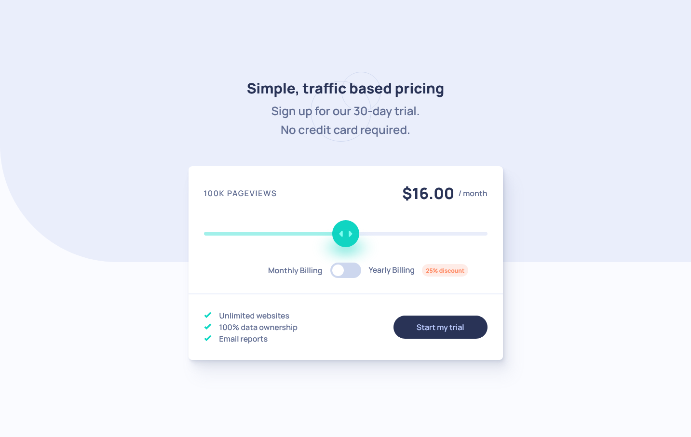

# Frontend Mentor - Interactive pricing component solution

This is a solution to the [Interactive pricing component challenge on Frontend Mentor](https://www.frontendmentor.io/challenges/interactive-pricing-component-t0m8PIyY8).

## Table of contents

- [Overview](#overview)
  - [The challenge](#the-challenge)
  - [Screenshot](#screenshot)
  - [Links](#links)
- [My process](#my-process)
  - [Built with](#built-with)
  - [What I learned](#what-i-learned)
  - [Continued development](#continued-development)
  - [Useful resources](#useful-resources)
- [Author](#author)
- [Acknowledgments](#acknowledgments)

## Overview

### The challenge

Users should be able to:

- View the optimal layout for the app depending on their device's screen size
- See hover states for all interactive elements on the page
- Use the slider and toggle to see prices for different page view numbers

### Screenshot

### Links

- Solution URL: [Add solution URL here](https://your-solution-url.com)
- Live Site URL: [Deployed App](https://interactive-pricing-component-pied.vercel.app/)

## My process

### Built with

- Semantic HTML markup
- CSS custom properties
- Flexbox
- CSS Grid
- Mobile-first workflow
- [React](https://reactjs.org/)
- [Next.js](https://nextjs.org/)
- [Vanilla Extract](https://styled-components.com/) - Typescript CSS Management
- [Framer Motion](https://www.framer.com/motion/) - for Spring Animation

### What I learned

The challenge here was maintaining accessibility while building custom UI controls. The slider was fairly difficult to implement while still maintaining some an accessible experience with a screen reader.
I made sure that the two derived values (the number of page-views and price per month) were using `<output>` elements, and linked to the `<input type="range">`. This ensures that when those values are updated because a user moves the slider or toggles the billing period, the changes are announced. The native semantic elements give this behaviour without having to rely on `aria-live` regions.

Native range inputs are difficult to style, so I created a custom component, that uses a transparent `<input type="range">` element to manage the values, but then lays styled elements on top of this, translating their position based on the value of the input. I've used some of the newer CSS filter options to blur the shadow.

I wanted to have the numbers animate as they change, so I used Framer Motion to give me a spring hook. I then wrapped that in my own custom hook, so I could use its values to directly manipulate the DOM text values. Directly manipulating the DOM in a `useEffect` is not ideal. But for animation it's important, so that React doesn't try to rerender every animation value change.

### Continued development

There are a few things in here that I'd like to improve on. The custom slider control has an overflow problem which means its parent has to have `overflow: hidden` to avoid horizontal scroll. I couldn't find a good way to solve that within the other constraints of the component.

I'd like to try testing with different screen readers. I used the built in Windows Narrator. But it would be good to get some practice with NVDA or JAWS.

### Useful resources

- [Keyframers - Diamond Slider](https://www.youtube.com/watch?v=CGfmYWfNbdA&t=1439s) - This approach to re-styling the slider I found very useful, I borrowed quite a few ideas from it

## Author

- Website - [Alex Marshall](https://github.com/AlexKMarshall)
- Frontend Mentor - [@AlexKMarshall](https://www.frontendmentor.io/profile/AlexKMarshall)
- Twitter - [@AlexKMarshall1](https://twitter.com/alexkmarshall1)

## Acknowledgments

Thanks to [@gracesnow](https://github.com/grace-snow) for pointing me in the right direction of an accessible radio button group styled as a toggle. The overlapping labels and switching z-index trick worked great.
